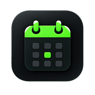

<p align="center">
  
</p>

<h1 align="center">Dayboxd</h1>

<p align="center">
  <strong>Treat every day like a feature film.</strong><br>
  <em>A cinematic, offline-first micro-journaling sanctuary designed for cinephiles and visual thinkers.</em>
</p>

<p align="center">
  <a href="https://github.com/parthpatyl/dayboxd-app/releases/latest">
    
  </a>
  
  
  
  
  
  
</p>

---

## 🎬 Why Dayboxd?

Traditional journaling often fails because of the **"Blank Page Dread"**—staring at an empty prompt and feeling pressured to write an essay at 11:30 PM.

**Dayboxd changes the medium:**
Instead of a burdensome diary, your life is framed through the lens of cinema:
- **Rate your days** from `0.5 ★` to `5.0 ★` with Letterboxd-style half-star precision.
- **Log micro-scenes** throughout the day (`+ Scene`) with timestamps and mood tags.
- **Collect 2:3 vertical film posters** for each day of your life.
- **Pin your Top 4** favorite days to your personal Criterion-style showcase.
- **100% Offline & Private:** No signups, no cloud tracking, no subscriptions. Everything stays encrypted on your device.

---

## ✨ Key Features

### ⏱️ 1. Continuous Live Studio
Log scenes incrementally as life unfolds. Tap `+ Scene` in the morning, afternoon, or evening. Add timestamps, scene descriptions, and dialogue quotes in seconds without writing a memoir.

### ⭐ 2. 0.5 – 5.0 Star Ratings & Liked Hearts
Give your day a definitive rating, toggle the red `Liked Heart` for memorable moments, and log your signature **"Dialogue of the Day"**.

### 🎨 3. 2:3 Cinematic Poster Wall
Every day receives a vertical 2:3 cinema poster card:
- **Automatic Fallback Templates:** Beautiful built-in day-of-week aesthetics (Monday *Opening Scene*, Wednesday *Midweek Pause*, Friday *Nocturne*, Sunday *Reset*).
- **Custom Photography:** Snap or upload your own photo with automatic client-side compression and local Blob storage.

### 🏆 4. Top 4 Criterion Pinboard
Curate your all-time four greatest days on your profile page, complete with poster art, ratings, and quotes.

### 📊 5. Pro-Style Analytics & Heatmaps
Handcrafted, lightweight native SVG visualizations (zero chart bloat):
- **Rating Distribution:** 10-bucket half-star histogram.
- **Activity Heatmap:** 52-week GitHub-style contribution grid.
- **Weekly Trend Curves:** Day-of-week average rating breakdowns and streak metrics.

### 🎟️ 6. Vintage Ticket Exporter
Generate high-resolution retro cinema tickets with decorative barcodes, theater stamps, and star ratings—perfect for sharing to Instagram Stories without revealing your private journal notes.

### 🔒 7. 100% Local-First & Zero Telemetry
Built on Dexie.js (IndexedDB). Your data never leaves your hardware. Export and restore full JSON archives and Markdown bundles anytime in Settings.

---

## 📱 Download & Install

### Direct APK Download
Download the standalone APK directly from our releases:
👉 **[Download Dayboxd APK (v1.0.0)](https://github.com/parthpatyl/dayboxd-app/releases/latest)**

### Sideloading via ADB
If you have an Android device connected with USB Debugging:
```bash
adb install -r dayboxd-app.apk
adb shell am start -n app.letterboxd.days/.MainActivity
```

---

## 🛠️ Architecture & Tech Stack

```
dayboxd-app/
├── android/               # Native Android Capacitor Project (Java & Gradle)
│   └── app/src/main/res/  # Launcher mipmaps & splash screens
├── public/                # Static assets, fallback posters, and app icons
├── src/
│   ├── components/
│   │   ├── charts/        # Native SVG rating histograms & heatmaps
│   │   ├── export/        # High-res Canvas/DOM vintage ticket exporter
│   │   ├── layout/        # App Shell, responsive Navigation, Header
│   │   ├── posters/       # 2:3 Poster templates & custom photo renderer
│   │   └── ui/            # Star ratings, modals, segmented pickers, toasts
│   ├── db/                # Dexie.js IndexedDB schema & image store
│   ├── lib/               # Date utilities, notification channels, storage safety
│   ├── store/             # Reactive store for profile, theme, and UI state
│   └── views/             # Logbook, Diary, Film Wall, Stats, Profile, Settings
└── package.json
```

---

## 🚀 Development Setup

### Prerequisites
- [Node.js](https://nodejs.org/) (v18 or higher)
- [Android Studio](https://developer.android.com/studio) (for native Android builds)
- [JDK 17+](https://adoptium.net/)

### 1. Clone the repository
```bash
git clone https://github.com/parthpatyl/dayboxd-app.git
cd dayboxd-app
```

### 2. Install dependencies
```bash
npm install
```

### 3. Run Web Dev Server
```bash
npm run dev
```

### 4. Build & Sync to Android
```bash
# Build React application
npm run build

# Sync web assets to native Android container
npx cap sync android

# Open in Android Studio
npx cap open android
```

### 5. Compile Android APK via CLI
```bash
cd android
./gradlew assembleDebug
```
The output APK will be generated at `android/app/build/outputs/apk/debug/app-debug.apk`.

---

## 🛡️ Privacy & Permissions

- `INTERNET`: Required by Capacitor WebView engine for local resource loading.
- `POST_NOTIFICATIONS`: Optional permission for daily evening log reminders (scheduled strictly on-device).
- `SCHEDULE_EXACT_ALARM`: Local notification triggers (zero background battery drain).

---

## 📄 License

This project is licensed under the **MIT License** — see the [LICENSE](LICENSE) file for details.
